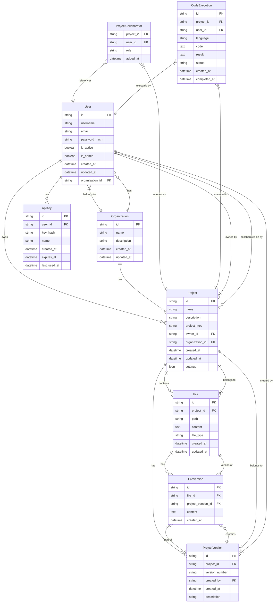

# Entity Relationship Diagram

## Overview

This document provides the Entity Relationship Diagram for the WindSurf AI Coding Platform database.

## Relationships

### User
- A User can own many Projects
- A User can have many ApiKeys
- A User can collaborate on many Projects
- A User belongs to one Organization

### Organization
- An Organization can have many Users
- An Organization can have many Projects

### Project
- A Project is owned by one User
- A Project can have many Files
- A Project can have many ProjectVersions
- A Project can have many Collaborators (Users)
- A Project belongs to one Organization

### File
- A File belongs to one Project
- A File can have many FileVersions

### ProjectVersion
- A ProjectVersion belongs to one Project
- A ProjectVersion is created by one User
- A ProjectVersion can have many FileVersions

### FileVersion
- A FileVersion belongs to one File
- A FileVersion belongs to one ProjectVersion

### ApiKey
- An ApiKey belongs to one User

### CodeExecution
- A CodeExecution belongs to one Project
- A CodeExecution is executed by one User
